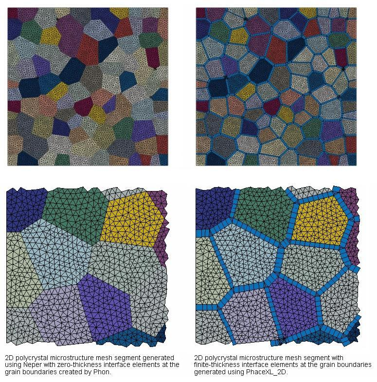

## PhaceXL 2D

#### Description

PhaceXL_2D is a script for the generation of finite-thickness interface elements for 2D polycrystal microstructure modelling. It parses a 2D polycrystal microstructure mesh file generated using the [Neper](http://neper.sourceforge.net/) software package and modified using the [Phon](http://github.com/KristofferC/Phon) cohesive element generator and shrinks the existing grains by a predefined factor to create finite-thickness interface elements, facilitating the modelling of damage phenomena occuring at the grain boundaries. If the original 2D polycrystal microstructure mesh is periodic, PhaceXL_2D retains mesh periodicity at the boundary of the modelling domain. The resulting mesh is exported in a format readable by Abaqus&#8482; finite-element analysis software or similar preprocessors.

To generate a 2D polycrystal microstructure mesh with finite-thickness interface elements at the grain boundaries, the following steps have to be followed:

1. Generate a 2D polycrystal microstructure mesh using [Neper](http://neper.sourceforge.net/).
2. Export the polycrystal mesh as well as the coordinates of the grain centroids.
3. Use [Phon](http://github.com/KristofferC/Phon) to insert zero-thickness cohesive elements at the grain boundaries.
4. Parse both files in PhaceXL_2D to generate finite-thickness interface elements at the grain boundaries.

#### Usage

Run [PhaceXL_2D](main/phaceXL_2D.py) using &nbsp; '*phaceXL_2D.py -i INPUTFILENAME -c CENTROIDFILENAME -p MPER -s SFACTOR*' &nbsp; from the command line. The following input parameters have to be specified:

 *INPUTFILENAME*: &nbsp; name of the file containing the polycrystal mesh and the cohesive elements generated by [Neper](http://neper.sourceforge.net/) and [Phon](http://github.com/KristofferC/Phon),  
 *CENTROIDFILENAME*: &nbsp; name of the file containing the coordinates of the grain centroids,  
 *MPER*:             &nbsp; indication whether the polycrystal microstructure mesh is periodic ('y') or (by default) non-periodic ('n'),  
 *SFACTOR*:          &nbsp; factor controlling the amount of shrinkage for each grain.  

PhaceXL_2D has been tested with [Python](http://www.python.org/downloads/) 3.7.2 and [NumPy](http://www.scipy.org/scipylib/download.html) 1.16.2.

#### License

PhaceXL_2D is licensed under the [GNU General Public License](https://github.com/Mote3D/PhaceXL_2D/blob/master/LICENSE).
